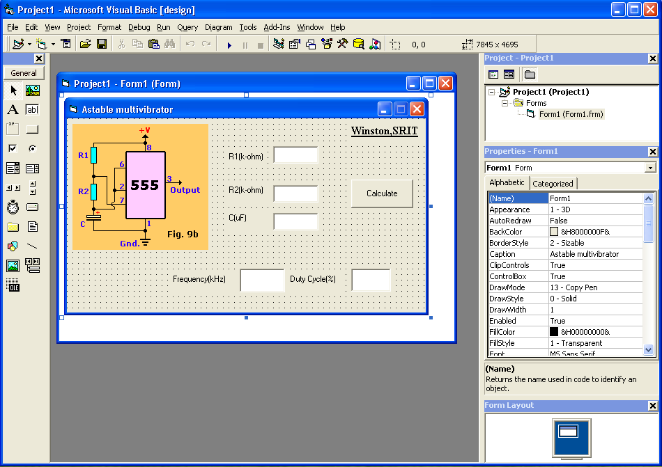
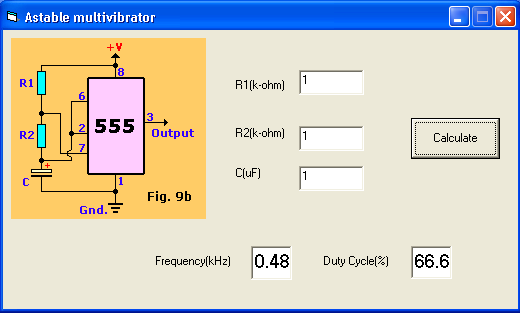
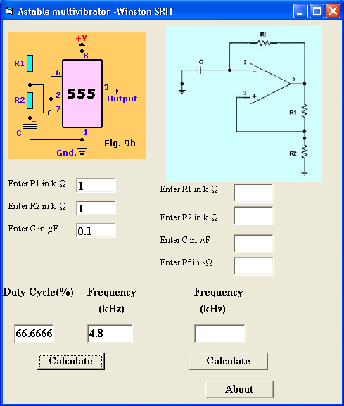

# Astable multivibrator - Windows App

This application was developed back in 2013 when I was doing 2nd year of B.E EEE.

I was encouraged by [Dr. R.JayaPal](https://www.linkedin.com/in/jayapal-r-74b41a13/) to do this and show it as teaching material to students (for **Linear Integrated Circuits** course)

Requires Microsoft Visual Basic 6 to build the Application.

## Steps to build the VB6 project
- Install Microsoft Visual Basic 6 (Runs only Windows XP and earlier versions of Windows ! :neutral_face:)
- Open `.vbp` file with Visual Basic
- Click **File -> Make Project1.exe** to generate the executable file (runs even in latest version of Windows !! :upside_down_face:)

## Astable multivibrator with `555 IC`

## Astable multivibrator with `555 IC` and `741 OP-AMP IC`

